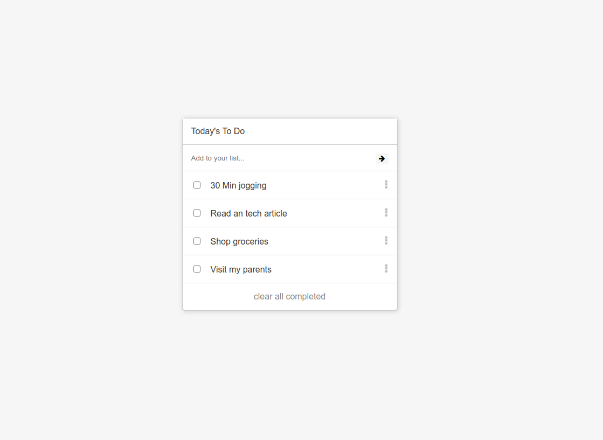

# To-Do List
This is minimalist To-Do app. It allows the user to stay organized by offering the following possibilies:
- Possibility to create a list of tasks 
- Possibility to mark them as completed
- Possibility to remove a task
- Possibility to re-order tasks
- Possibility to remove all completed tasks

## Screenshot



## Live demo

Click [here](https://mugberto.github.io/to-do-list/) to view

## Built With

- HTML
- CSS
- Javascript
- Webpack


## Getting Started

To get a local copy up and running follow these simple steps inside the root folder.

### Setup

Install dependencies with:

```
npm run build
```

### Usage

Start server with:

```
npm start
```

it will open `http://localhost:3000/` in your default browser.

## Authors

👤 **Hubert MUGABO**

- Github: [@mugberto](https://github.com/mugberto)
- Twitter: [@mugberto](https://twitter.com/mugberto)
- Linkedin: [mugberto](https://www.linkedin.com/in/hubert-mugabo-23144b6a/)

## 🤝 Contributing

Contributions, issues and feature requests are welcome!

Feel free to check the [issues page](https://github.com/mugberto/to-do-list/issues).

## Show your support

Give a ⭐️ if you like this project!

## Acknowledgments

- Microverse

## 📝 License

This project is MIT Lisenced